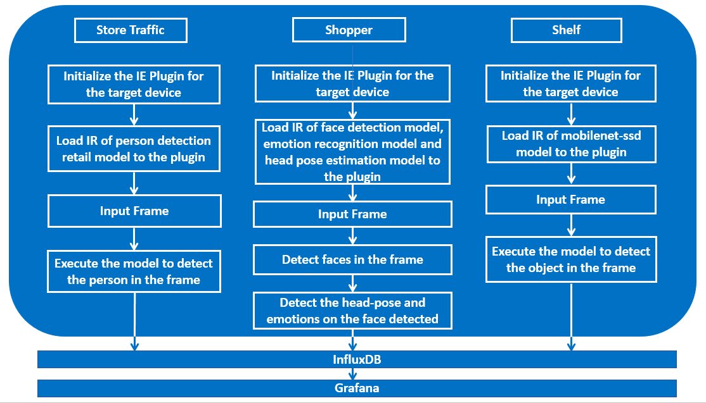
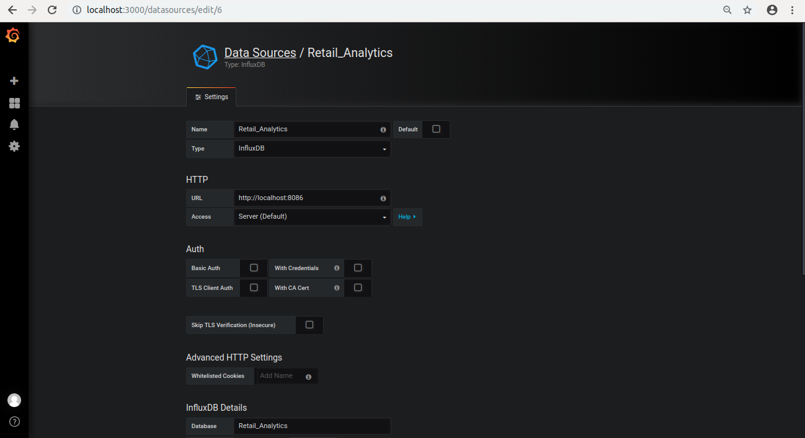
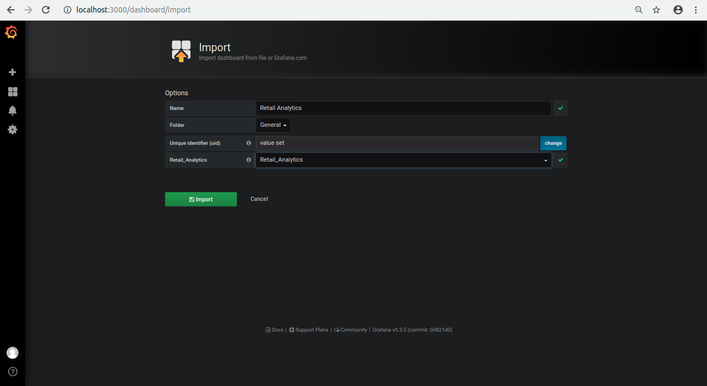

# Retail Analytics

| Details           |              |
|-----------------------|---------------|
| Target OS:            |  Ubuntu\* 16.04 LTS   |
| Programming Language: |  Python* 3.5 |
| Time to Complete:    |  50-70min     |


## What it does
This smart retail analytics application monitors people activity, counts total number of people inside a retail store and keeps a check on the inventory by detecting the products specified by the user. It detects objects on any number of screens by using video or camera resources.

## Requirements
### Hardware
* 6th to 8th Generation Intel® Core™ processors with Iris® Pro graphics or Intel® HD Graphics

### Software
* [Ubuntu\* 16.04 LTS](http://releases.ubuntu.com/16.04/)<br>
   *Note*: We recommend using a 4.14+ Linux* kernel with this software. Run the following command to determine your kernel version:
   ```
   uname -a
   ```
* OpenCL™ Runtime Package
* Intel® Distribution of OpenVINO™ toolkit 2019 R3 release
* Grafana* v5.3.2 
* InfluxDB* v1.6.2

## How It works
The application uses the Inference Engine included in the Intel® Distribution of OpenVINO™ toolkit. It accepts multiple video input feeds and user can specify the feed type for each video. 
There are three feed types that application supports:
* Shopper: If the feed type of the video is shopper, the application grabs the frame from that input stream and uses a Deep Neural Network model for detecting the faces in it. If there is anybody present in the frame, it is counted as a shopper. Once the face is detected, the application uses head-pose estimation model to check the head pose of the person. If the person is looking at the camera then his emotions are detected using emotions recognition model. Using the data obtained from this, it infers if the person is interested or not and gives the total number of people detected. It also measures the duration for which the person is present in the frame and the duration for which he was looking at the camera.

* Store traffic: If the video feed type is traffic, the application uses a Deep Neural Network model to detect people in the frame. The total number of people visited and the number of people currently present in front the camera is obtained from this.

* Shelf: This feed type is used to keep a check on the product inventory. If the video feed type is shelf, an object detection model is used to detect the product specified by the user in the frame from this video stream. It detects the objects and gives the number of objects present in the frame.

The application is capable of processing multiple video input feeds, each having different feed type. The data obtained from these videos is stored in InfluxDB for analysis and visualized on Grafana. It uses Flask python web framework to live stream the output videos to the Grafana.




**Architectural Diagram**

## Setup

### Get the code

Steps to clone the reference implementation: (smart-retail-analytics)

    sudo apt-get update && sudo apt-get install git
    git clone https://github.com/intel-iot-devkit/smart-retail-analytics.git

### Install the Intel® Distribution of OpenVINO™ toolkit
Refer to https://software.intel.com/en-us/articles/OpenVINO-Install-Linux on how to install and setup the Intel® Distribution of OpenVINO™ toolkit.

You will need the OpenCL™ Runtime Package if you plan to run inference on the GPU. It is not mandatory for CPU inference.

### Other dependencies
#### InfluxDB* 

InfluxDB is a time series database designed to handle high write and query loads. It is an integral component of the TICK stack. InfluxDB is meant to be used as a backing store for any use case involving large amounts of timestamped data, including DevOps monitoring, application metrics, IoT sensor data, and real-time analytics.

#### Grafana*

Grafana is an open-source, general purpose dashboard and graph composer, which runs as a web application. It supports Graphite, InfluxDB, Prometheus, Google Stackdriver, AWS CloudWatch, Azure Monitor, Loki, MySQL, PostgreSQL, Microsoft SQL Server, Testdata, Mixed, OpenTSDB and Elasticsearch as backends. Grafana allows you to query, visualize, alert on and understand your metrics no matter where they are stored.<br>

#### AJAX*

The AJAX Panel is a general way to load external content into a grafana dashboard.

### Which model to use
The application uses  Intel® Pre-Trained models in the feed type `shopper` i.e.[face-detection-adas-0001](https://docs.openvinotoolkit.org/2019_R3/_models_intel_face_detection_adas_0001_description_face_detection_adas_0001.html), [head-pose-estimation-adas-0001](https://docs.openvinotoolkit.org/2019_R3/_models_intel_head_pose_estimation_adas_0001_description_head_pose_estimation_adas_0001.html), [emotion-recognition-retail-0003](https://docs.openvinotoolkit.org/2019_R3/_models_intel_emotions_recognition_retail_0003_description_emotions_recognition_retail_0003.html). For the feed type `traffic`, [person-detection-retail-0002](https://docs.openvinotoolkit.org/2019_R3/person-detection-retail-0002.html) is used and these can be downloaded using **model downloader** script.

For video feed type __shelf__, mobilenet-ssd model is used that can be downloaded using `downloader` script present in Intel® Distribution of OpenVINO™ toolkit.
The `mobilenet-ssd` model is a Single-Shot multibox Detection (SSD) network intended to perform object detection. This model is implemented using the Caffe\* framework. For details about this model, check out the [repository](https://github.com/chuanqi305/MobileNet-SSD).

To install the dependencies and to download the models and optimize **mobilenet-ssd** model, run the below command:
   ```
   cd <path_to_the_smart-retail-analytics-python_directory>
   ./setup.sh
   ```
* These models will be downloaded in the locations given below: 
   * **face-detection**: /opt/intel/openvino/deployment_tools/open_model_zoo/tools/downloader/intel/face-detection-adas-0001/
   * **head-pose-estimation**: /opt/intel/openvino/deployment_tools/open_model_zoo/tools/downloader/intel/head-pose-estimation-adas-0001/
   * **emotions-recognition**: /opt/intel/openvino/deployment_tools/open_model_zoo/tools/downloader/intel/emotions-recognition-retail-0003/
   * **person-detection-retail**: /opt/intel/openvino/deployment_tools/open_model_zoo/tools/downloader/intel/person-detection-retail-0002/

<br>

### The Labels file
The shelf feed type in the application requires a _labels_ file associated with the model being used for detection. All detection models work with integer labels and not string labels (e.g. for the ssd300 and mobilenet-ssd models, the number 15 represents the class "person"), that is why each model must have a _labels_ file, which associates an integer (the label the algorithm detects) with a string (denoting the human-readable label).
The _labels_ file is a text file containing all the classes/labels that the model can recognize, in the order that it was trained to recognize them (one class per line).<br> 
For mobilenet-ssd model, _labels.txt_ file is provided in the _resources_ directory.

### The Config file
The **resources/config.json** contains the videos along with the video feed type. 
The _config.json_ file is of the form name/value pair, `"video": <path/to/video>` and `"type": <video-feed-type>`
For example:
```
{

    "inputs": [

	    {
            "video": "path-to-video",
            "type": "video-feed-type"
        }
    ]

}
```
The `path-to-video` is the path, on the local system, to a video to use as input.

If the video type is shelf, then the labels of the class (person, bottle, etc.) to be detected on that video is provided in the next column. The labels used in the _config.json_ file must be present in the labels from the _labels_ file.<br> 

The application can use any number of videos for detection (i.e. the _config.json_ file can have any number of blocks), but the more videos the application uses in parallel, the more the frame rate of each video scales down. This can be solved by adding more computation power to the machine the application is running on.

### What input video to use
The application works with any input video. Sample videos for object detection are provided [here](https://github.com/intel-iot-devkit/sample-videos/).  <br>

For first-use, we recommend using the [face-demographics-walking](https://github.com/intel-iot-devkit/sample-videos/blob/master/face-demographics-walking.mp4), [head-pose-face-detection-female](https://github.com/intel-iot-devkit/sample-videos/blob/master/head-pose-face-detection-female.mp4), [bottle-detection](https://github.com/intel-iot-devkit/sample-videos/blob/master/bottle-detection.mp4) videos. The videos are automatically downloaded in the `resources/` folder by setup.sh.
For example:<br>
The config.json would be:

```
{

    "inputs": [

	    {
            "video": "sample-videos/head-pose-face-detection-female.mp4",
            "type": "shopper"
        },
        {
            "video": "sample-videos/bottle-detection.mp4",
            "label": "bottle",
            "type": "shelf"
        },
        {
            "video": "sample-videos/face-demographics-walking.mp4",
            "type": "traffic"
        }
    ]

}
```
To use any other video, specify the path in config.json file

### Using camera stream instead of the video file
Replace `path/to/video` with the camera ID in config.json and the label to be found, where the ID is taken from the video device (the number X in /dev/videoX).
On Ubuntu, to list all available video devices use the following command:
```
ls /dev/video*
```
For example, if the output of above command is `/dev/video0`, then config.json would be:

```
{

    "inputs": [

	    {
            "video": "0",
            "type": "shopper"
        }
    ]

}
```

## Setup the environment
You must configure the environment to use the Intel® Distribution of OpenVINO™ toolkit one time per session by running the following command:
```
source /opt/intel/openvino/bin/setupvars.sh -pyver 3.5
```
__Note__: This command needs to be executed only once in the terminal where the application will be executed. If the terminal is closed, the command needs to be executed again.
    
## Run the application

Change the current directory to the git-cloned application code location on your system:
    
```
cd <path_to_the_smart-retail-analytics-python_directory>/application
```

To run the application with the required models:
```
python3 smart_retail_analytics.py -fm /opt/intel/openvino/deployment_tools/open_model_zoo/tools/downloader/intel/face-detection-adas-0001/FP32/face-detection-adas-0001.xml -pm /opt/intel/openvino/deployment_tools/open_model_zoo/tools/downloader/intel/head-pose-estimation-adas-0001/FP32/head-pose-estimation-adas-0001.xml -mm /opt/intel/openvino/deployment_tools/open_model_zoo/tools/downloader/intel/emotions-recognition-retail-0003/FP32/emotions-recognition-retail-0003.xml -om ../resources/FP32/mobilenet-ssd.xml -pr /opt/intel/openvino/deployment_tools/open_model_zoo/tools/downloader/intel/person-detection-retail-0002/FP32/person-detection-retail-0002.xml -lb ../resources/labels.txt -l /opt/intel/openvino/inference_engine/lib/intel64/libcpu_extension_sse4.so
```
Once the command is executed in the terminal, configure the Grafana dashboard using the instructions given in the next section to see the output.<br>
To run the application on sync mode, use **-f sync** as command line argument. By default, the application runs on async mode.

 ## Running on different hardware

The application can use different hardware accelerator for different models. The user can specify the target device for each model using the command line argument as below:
* `-d_fm <device>`: Target device for Face Detection network (CPU, GPU, MYRIAD, HETERO:FPGA,CPU or HDDL).
* `-d_pm <device>`: Target device for Head Pose Estimation network (CPU, GPU, MYRIAD, HETERO:FPGA,CPU or HDDL).
* `-d_mm <device>`: Target device for Emotions Recognition network (CPU, GPU, MYRIAD, HETERO:FPGA,CPU or HDDL).
* `-d_om <device>`: Target device for mobilenet-ssd network (CPU, GPU, MYRIAD, HETERO:FPGA,CPU or HDDL).
* `-d_pd <device>`: Target device for Person Detection Retail network (CPU, GPU, MYRIAD, HETERO:FPGA,CPU or HDDL).

__For example:__<br>
To run Face Detection model with FP16 and Emotions Recognition model with FP32 on GPU, Head Pose Estimation model on MYRIAD, mobilenet-ssd and person-detection model on CPU, use the below command:
```
python3 smart_retail_analytics.py -fm /opt/intel/openvino/deployment_tools/open_model_zoo/tools/downloader/intel/face-detection-adas-0001/FP16/face-detection-adas-0001.xml -pm /opt/intel/openvino/deployment_tools/open_model_zoo/tools/downloader/intel/head-pose-estimation-adas-0001/FP16/head-pose-estimation-adas-0001.xml -mm /opt/intel/openvino/deployment_tools/open_model_zoo/tools/downloader/intel/emotions-recognition-retail-0003/FP32/emotions-recognition-retail-0003.xml -om ../resources/FP32/mobilenet-ssd.xml -pr /opt/intel/openvino/deployment_tools/open_model_zoo/tools/downloader/intel/person-detection-retail-0002/FP32/person-detection-retail-0002.xml -lb ../resources/labels.txt -l /opt/intel/openvino/inference_engine/lib/intel64/libcpu_extension_sse4.so -d_fm GPU -d_pm MYRIAD -d_mm GPU -d_pd CPU -d_om CPU
```
To run with multiple devices use -d MULTI:device1,device2. For example: `-d MULTI:CPU,GPU,MYRIAD`<br>
By default, the application runs on CPU.<br>
**Note:**<br>
* The Intel® Neural Compute Stick and Intel® Movidius™ VPU can only run FP16 models. The model that is passed to the application, must be of data type FP16.<br>
<!--2. To run the application on FPGA, follow the steps mentioned under **Run on the FPGA** section.<br>-->

   **FP32**: FP32 is single-precision floating-point arithmetic uses 32 bits to represent numbers. 8 bits for the magnitude and 23 bits for the precision. For more information, [click here](https://en.wikipedia.org/wiki/Single-precision_floating-point_format)<br>
   **FP16**: FP16 is half-precision floating-point arithmetic uses 16 bits. 5 bits for the magnitude and 10 bits for the precision. For more information, [click here](https://en.wikipedia.org/wiki/Half-precision_floating-point_format)

### Run on the Intel® Movidius™ VPU

To run the application on Intel® Movidius™ VPU, configure the hddldaemon by following the below steps:<br>
* Open the hddl_service.config using the below command:
    ```
    sudo vi ${HDDL_INSTALL_DIR}/config/hddl_service.config
    ```
*  Update **"device_snapshot_mode":    "None"** to **"device_snapshot_mode":    "full"**.
*  Update HDDL configuration for tags.
    ```
    "graph_tag_map":{"tagFace":1,"tagPose":1,"tagMood":2,"tagMobile":2,"tagPerson":2}
    ```
* Save and close the file.

* Run hddldaemon.<br>
    ```
    ${HDDL_INSTALL_DIR}/bin/hddldaemon
    ```
To run the application on the Intel® Movidius™ VPU, use the `-d HDDL` command-line argument:
```
python3 smart_retail_analytics.py -fm /opt/intel/openvino/deployment_tools/open_model_zoo/tools/downloader/intel/face-detection-adas-0001/FP16/face-detection-adas-0001.xml -pm /opt/intel/openvino/deployment_tools/open_model_zoo/tools/downloader/intel/head-pose-estimation-adas-0001/FP16/head-pose-estimation-adas-0001.xml -mm /opt/intel/openvino/deployment_tools/open_model_zoo/tools/downloader/intel/emotions-recognition-retail-0003/FP16/emotions-recognition-retail-0003.xml -om ../resources/FP16/mobilenet-ssd.xml -pr /opt/intel/openvino/deployment_tools/open_model_zoo/tools/downloader/intel/person-detection-retail-0002/FP16/person-detection-retail-0002.xml -lb ../resources/labels.txt -d_pd HDDL -d_fm HDDL -d_pm HDDL -d_mm HDDL -d_om HDDL
```

#### Run on the Intel® Arria® 10 FPGA

Before running the application on the FPGA, set the environment variables and  program the AOCX (bitstream) file.<br>

Set the Board Environment Variable to the proper directory:

```
export AOCL_BOARD_PACKAGE_ROOT=/opt/intel/openvino/bitstreams/a10_vision_design_sg<#>_bitstreams/BSP/a10_1150_sg<#>
```
**NOTE**: If you do not know which version of the board you have, please refer to the product label on the fan cover side or by the product SKU: Mustang-F100-A10-R10 => SG1; Mustang-F100-A10E-R10 => SG2 <br>

Set the Board Environment Variable to the proper directory:
```
export QUARTUS_ROOTDIR=/home/<user>/intelFPGA/18.1/qprogrammer
```
Set the remaining environment variables:
```
export PATH=$PATH:/opt/altera/aocl-pro-rte/aclrte-linux64/bin:/opt/altera/aocl-pro-rte/aclrte-linux64/host/linux64/bin:/home/<user>/intelFPGA/18.1/qprogrammer/bin
export INTELFPGAOCLSDKROOT=/opt/altera/aocl-pro-rte/aclrte-linux64
export LD_LIBRARY_PATH=$LD_LIBRARY_PATH:$AOCL_BOARD_PACKAGE_ROOT/linux64/lib
export CL_CONTEXT_COMPILER_MODE_INTELFPGA=3
source /opt/altera/aocl-pro-rte/aclrte-linux64/init_opencl.sh
```
**NOTE**: It is recommended to create your own script for your system to aid in setting up these environment variables. It will be run each time you need a new terminal or restart your system.

The bitstreams for HDDL-F can be found under the `/opt/intel/openvino/bitstreams/a10_vision_design_sg<#>_bitstreams/` directory.<br><br>To program the bitstream use the below command:<br>
```
aocl program acl0 /opt/intel/openvino/bitstreams/a10_vision_design_sg<#>_bitstreams/2019R3_PV_PL1_FP16_MobileNet_Clamp.aocx
```

For more information on programming the bitstreams, please refer the [link](https://software.intel.com/en-us/articles/OpenVINO-Install-Linux-FPGA#inpage-nav-11).

To run the application on the FPGA with floating point precision 16 (FP16), use the `-d HETERO:FPGA,CPU` command-line argument:
```
python3 smart_retail_analytics.py -fm /opt/intel/openvino/deployment_tools/open_model_zoo/tools/downloader/intel/face-detection-adas-0001/FP16/face-detection-adas-0001.xml -pm /opt/intel/openvino/deployment_tools/open_model_zoo/tools/downloader/intel/head-pose-estimation-adas-0001/FP16/head-pose-estimation-adas-0001.xml -mm /opt/intel/openvino/deployment_tools/open_model_zoo/tools/downloader/intel/emotions-recognition-retail-0003/FP16/emotions-recognition-retail-0003.xml -om ../resources/FP16/mobilenet-ssd.xml -pr /opt/intel/openvino/deployment_tools/open_model_zoo/tools/downloader/intel/person-detection-retail-0002/FP16/person-detection-retail-0002.xml -lb ../resources/labels.txt -l /opt/intel/openvino/inference_engine/lib/intel64/libcpu_extension_sse4.so -d_pd HETERO:FPGA,CPU -d_fm HETERO:FPGA,CPU -d_pm HETERO:FPGA,CPU -d_mm HETERO:FPGA,CPU -d_om HETERO:FPGA,CPU
```

### Visualize on Grafana

1. Start the Grafana server:

   ```
   sudo service grafana-server start
   ```

2. In your browser, go to [localhost:3000](http://localhost:3000).

3. Log in with user as **admin** and password as **admin**.

4. Click on **Configuration**.

5. Select **“Data Sources”**.

6. Click on **“+ Add data source”** and provide inputs below.

   - *Name*: Retail_Analytics
   - *Type*: InfluxDB
   - *URL*: http://localhost:8086
   - *Database*: Retail_Analytics
   - Click on “Save and Test”

   

7. Click on **+** icon present on the left side of the browser, select **import**.

8. Click on **Upload.json File**.

9. Select the file name __retail-analytics.json__ from smart-retail-analytics-python directory.

10. Select "Retail_Analytics" in **Select a influxDB data source**. 

    

11. Click on import.


## Containerize the Application

To containerize the smart-retail-analytics-python application using docker container, follow the instruction provided [here](./docker).
